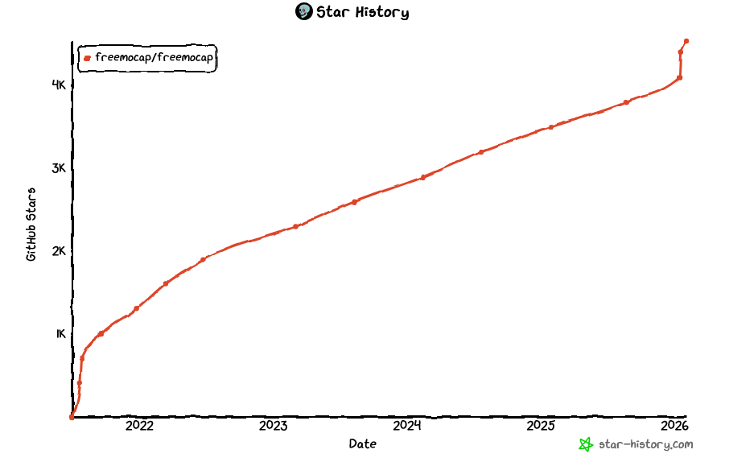
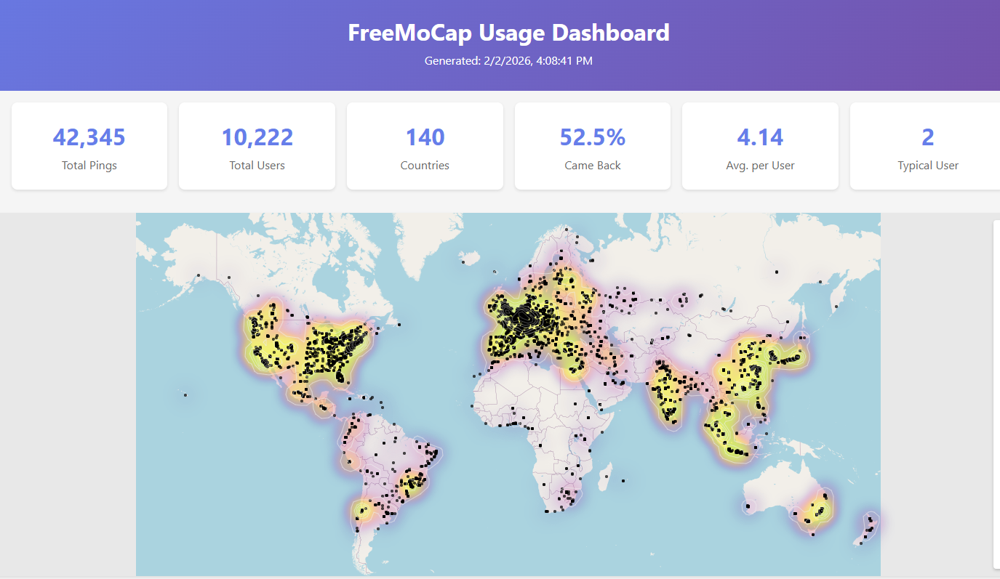

<!--
BUILD INSTRUCTIONS
==================
npm install -g @marp-team/marp-cli

HTML (for presenting, supports video):
  marp freemocap-2026-state-of-the-skelly.md -o slides.html --html

PDF (for sharing, no video):
  marp freemocap-2026-state-of-the-skelly.md -o slides.pdf --html --allow-local-files

Live preview:
  marp -w freemocap-2026-state-of-the-skelly.md --html

Presenting: Open HTML in browser, F=fullscreen, P=presenter view

Keep in same folder: .md, skelly-logo.png, skellycam-logo.png, *.mp4
-->

<!-- _class: title -->
<!-- _footer: "" -->

# 2026 State of the Skelly Address

## FreeMoCap Foundation

*Start: 6:30 PM  ·  Talk: 45-60 min  ·  Q&A to follow*

---

# Agenda

1. **Background** — An abbreviated history
2. **Current State** — Numbers, financials, clients
3. **Future Plans** — v2, curriculum, shop, FDA, Blender

---

<!-- _class: title -->

# Part I
## Background

---
<!-- _class: part-background -->

# 2017 — OpenPose Released

<!-- Video placeholder: lab footage -->

---
<!-- _class: part-background -->

# 2019 — Northeastern

<!-- Video placeholder: NEU footage -->

---
<!-- _class: part-background -->

# 2020 — COVID

---
<!-- _class: part-background -->

# 2021 — First Public Post

<!-- Video placeholder: first release video -->
---

<!-- _class: part-background -->

# 202? - Meowmaline

<!-- Video placeholder: meowmaline -->

---
<!-- _class: part-background -->

# 2026 — Today

Where we are now - the scary cliff approaches

---

<!-- _class: title -->

# Part II
## Current State

---
<!-- _class: part-current -->

# By the Numbers

| Metric | Count |
|--------|-------|
| ⭐ GitHub Stars | 4,533 |
| 💬 Discord Members | 3,387 |
| 🌐 Global Users | 10,222+ |
| 🗺️ Countries Reached | 140 |

- A field trip to Dataland - https://freemocap.org/data.html
---
<!-- _class: part-current -->

# Financials
- Doing Ok
- Will survive past the 2026 June 30 Scary Cliff
- ...but will be thrive??
<!-- Light slide — will discuss verbally -->

---
<!-- _class: part-current -->

# Clients

### Current Research Partners

- Ben Scholl - Developmental Laser Ferrets 
- DF - Mouse eye tracker and all-day Pupilometry 

---
<!-- _class: part-current -->

# Now Accepting Clients

**Interested in working with us?**

- Research collaborations
- Custom development
- Enterprise support

- Support tiers

---

<!-- _class: title -->

# Part III
## Future Plans

---
<!-- _class: part-future -->

# v2 Transition 🚀

### Realtime Demo

### Release Plan

- **Alpha** — Core functionality
- **Beta** — UI overhaul, testing
- **Full Release** — Production ready

---
<!-- _class: part-future -->

# Data Model Plans

### SkEP #1: Tidy Data + Parquet

| Current | Future |
|---------|--------|
| NumPy arrays | Tidy format |
| .npy files | Parquet files |
| Ad-hoc schema | Standardized schema |

---
<!-- _class: part-future -->

# Documentation Overhaul

Complete docs rewrite in progress

### FreeMoCap University 🎓

Microcertifications coming

---
<!-- _class: part-future -->

# SkellyShop 🛒

### Charuco Boards

Available now — print-on-demand

### Cameras

Coming soon

---
<!-- _class: part-future -->

# FreeMoCap Validation

### Aaron's Dissertation 📚

Completion unlocks next steps

### FDA 510(k) Certification

Future pathway

---
<!-- _class: part-future -->

# Blender Addon

### Rebranding

`FreeMoCap Blender Addon` → **SkellyBlender**

### Official Distribution

🎯 Goal: Blender's official addon page

---

<!-- _class: title -->
<!-- _footer: "" -->

# Thank You!

## Questions?

🌐 freemocap.org  ·  💻 github.com/freemocap  ·  💬 discord.gg/freemocap

---

# Video from URL

  <video src="https://www.w3schools.com/html/mov_bbb.mp4" controls style="max-height: 65vh; max-width: 90%;"></video>

---

# Video from Local File (Autoplay)

  <video src="local_video.mp4" autoplay muted loop style="max-height: 65vh;"></video>

