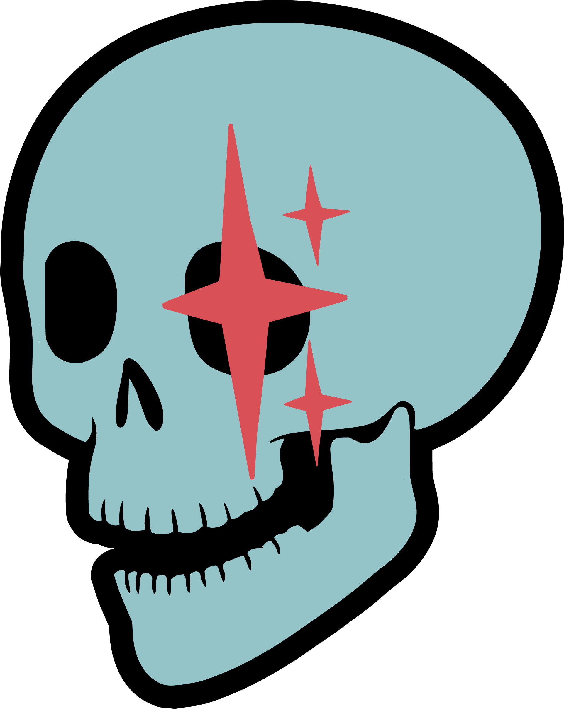
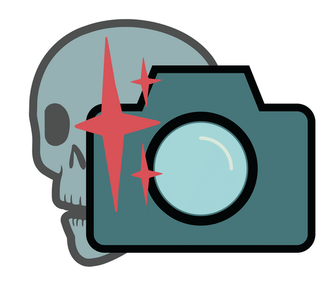

<!--
BUILD INSTRUCTIONS
==================
npm install -g @marp-team/marp-cli

HTML (for presenting, supports video):
  marp freemocap-2026-state-of-the-skelly.md -o slides.html --html

PDF (for sharing, no video):
  marp freemocap-2026-state-of-the-skelly.md -o slides.pdf --html --allow-local-files

Live preview:
  marp -w freemocap-2026-state-of-the-skelly.md --html

Presenting: Open HTML in browser, F=fullscreen, P=presenter view

Keep in same folder: .md, skelly-logo.png, skellycam-logo.png, *.mp4
-->

<!-- _class: title -->
<!-- _footer: "" -->

# 2026 State of the Skelly Address

## FreeMoCap Foundation

*Start: 6:30 PM | Talk: 45-60 min | Q&A to follow*

---

# Agenda

1. **Background** — An abbreviated history
2. **Current State** — Numbers, financials, clients
3. **Future Plans** — v2, curriculum, shop, FDA, Blender

---

<!-- _class: title -->

# Part I
## Background

---

# An Abbreviated History

Lorem ipsum dolor sit amet, consectetur adipiscing elit. Sed do eiusmod tempor incididunt ut labore et dolore magna aliqua.

- **2021** — Ut enim ad minim veniam, quis nostrud
- **2022** — Exercitation ullamco laboris nisi ut aliquip
- **2023** — Duis aute irure dolor in reprehenderit
- **2024** — Excepteur sint occaecat cupidatat non proident
- **2025** — Sunt in culpa qui officia deserunt mollit

---

<!-- _class: title -->

# Part II
## Current State

---

# By the Numbers

| Metric | Count |
|--------|-------|
| ⭐ GitHub Stars | X,XXX |
| 💬 Discord Members | X,XXX |
| 🌍 Global Users | XX,XXX |
| 🗺️ Countries Reached | XXX |

Lorem ipsum dolor sit amet, consectetur adipiscing elit sed do eiusmod.

---

# Financials

> *"Kinda loosey on specifics"*

Lorem ipsum dolor sit amet, consectetur adipiscing elit. Ut enim ad minim veniam, quis nostrud exercitation.

### Estimated Burn-Down Cliff

Duis aute irure dolor in reprehenderit in voluptate velit esse cillum dolore eu fugiat nulla pariatur.

---

# Clients

### Current Research Partners

- 🐹 **Ferrets** — Lorem ipsum dolor sit amet
- 🐭 **Mice** — Consectetur adipiscing elit

---

# 💰 Have Money? Let's Talk!

Lorem ipsum dolor sit amet, consectetur adipiscing elit, sed do eiusmod tempor incididunt ut labore.

**Contact us if you have funding for:**
- Research collaborations
- Custom development
- Enterprise support

---

<!-- _class: title -->

# Part III
## Future Plans

---

# v2 Transition 🚀

Lorem ipsum dolor sit amet, consectetur adipiscing elit.

### Realtime Demo

Sed do eiusmod tempor incididunt ut labore et dolore magna aliqua.

### Release Plan

- **Alpha** → Ut enim ad minim veniam
- **Beta** → Quis nostrud exercitation
- **Full Release** → Ullamco laboris nisi

---

# Data Model Plans

### SkEP #1: Tidy Data + Parquet

| Current | Future |
|---------|--------|
| Lorem ipsum | Tidy format |
| Dolor sit | Parquet files |
| Amet consectetur | Standardized schema |

Duis aute irure dolor in reprehenderit in voluptate velit esse cillum.

---

# UI Transition Plan

Lorem ipsum dolor sit amet, consectetur adipiscing elit, sed do eiusmod tempor incididunt.

- Excepteur sint occaecat cupidatat
- Non proident sunt in culpa
- Qui officia deserunt mollit anim

---

# FMCU — FreeMoCap Curriculum

### Docs Overhaul

Lorem ipsum dolor sit amet, consectetur adipiscing elit.

### Microcertifications 🎓

- Sed do eiusmod tempor
- Incididunt ut labore
- Et dolore magna aliqua

---

# SkellyShop 🛒

### Phase 1: Charuco Boards

- With cheatsheet included!
- Lorem ipsum dolor sit amet

### Phase 2: Cameras & More

- Consectetur adipiscing elit
- Sed do eiusmod tempor

---

# FDA 510(k) Certification

### Validation Project

Lorem ipsum dolor sit amet, consectetur adipiscing elit.

### Aaron's Dissertation 📚

Completion unlocks FDA certification pathway!

Duis aute irure dolor in reprehenderit in voluptate velit esse cillum dolore.

---

# Blender Addon

### Rebranding

`FreeMoCap Blender Addon` → **SkellyBlender**

### Official Distribution

🎯 Goal: Get listed on Blender's official addon page

Lorem ipsum dolor sit amet, consectetur adipiscing elit.

---

<!-- _class: title -->
<!-- _footer: "" -->

# Thank You!

## Questions?

🌐 freemocap.org | 💻 github.com/freemocap | 💬 discord.gg/freemocap

---

# Video from URL

  <video src="https://www.w3schools.com/html/mov_bbb.mp4" controls style="max-height: 65vh; max-width: 90%;"></video>

---

# Video from Local File (Autoplay)

  <video src="local_video.mp4" autoplay muted loop style="max-height: 65vh;"></video>

