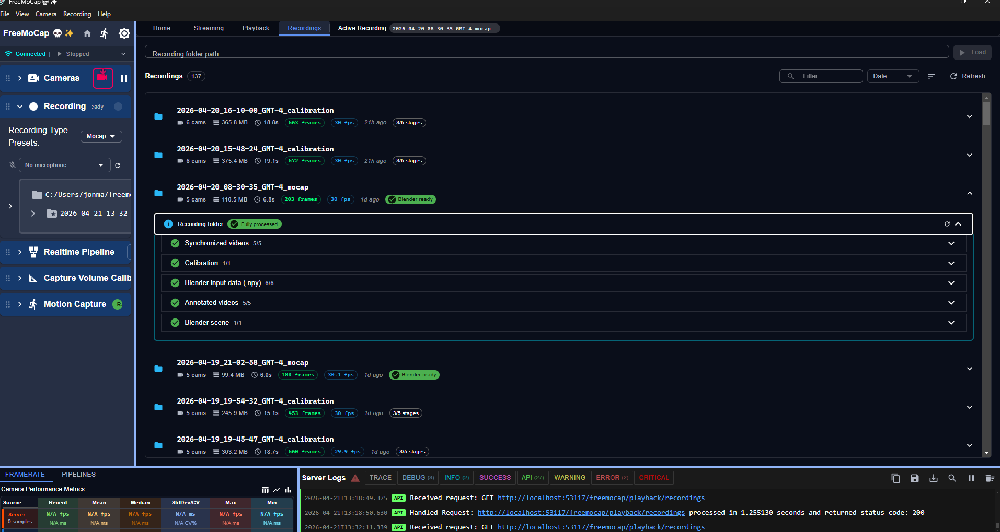
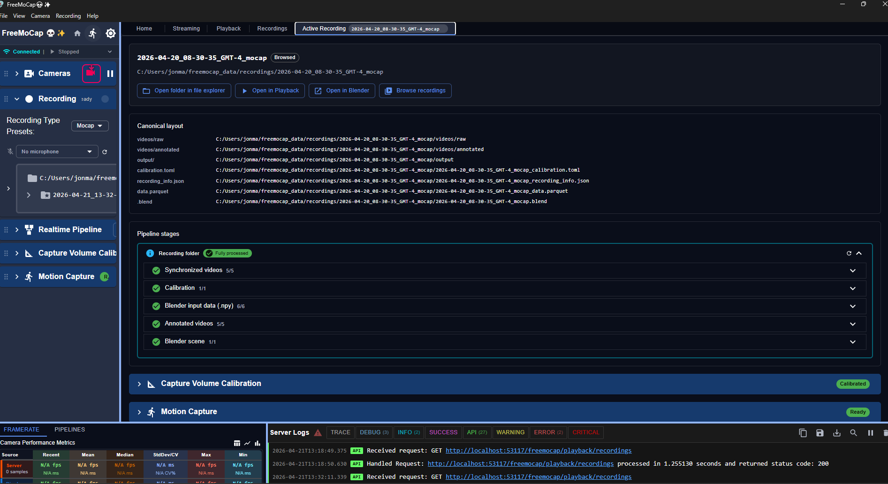

## Funding

FreeMoCap Foundation (FMC-F) is finally (almost) totally set up and able to submit federal grants, and I'm planning to submit roughly 4 proposals between now and Oct - basically a 2x2 grid of  the NIH- and NSF-flavored versions of two types of grants: two grants to support FOSS projects (NSF: POSE, and some NIH equivalent whose code I forget atm), and one SBIR/STTV each to both agencies. 

I'll probably want to tap you for all of them to some extent, but the NIH flavored SBIR (or STTR, I can never remember which is which) is the most relevant. That's the one I will write on a business plan to expand the kind of set we built for ferret tracking to create a modular system to recording full body mocap and integrated eye tracking for any species (mouse, rat, monkey, human, etc) while producing exactly matched data models. I think the NIH will like that way of bridging animal/human studies. 

These NIH-SBIR could build a connection between the for-profit arm of the FreeMoCap Foundation (SkellyTech, LLC) and you (via CU), if you're into it. 

The NSF-STTR will prob be similar, but more geared towards building low-cost freemocap teaching kits. Same data model as the ferrets, but very different focus. That one will pair the FreeMoCap Foundation with the for-profit LLC. 

The other two grants (NSF POSE and the NSF equivalent) will probably want you to sign on as at least a collaborator or something. The NSF-POSE is mostly geared toward governance, while the NIH one is more research focused. Both of those are due in the Fall, so I'm starting to get serious about planning them now. 

## Our plans

So the currently plan involves you paying FMC-F $100k/yr, which works out to ~$33k/quarter. The last pay period went through Q1, which ended at end of March 2026. 

Assuming that we're talking about LESS money and not NO money, I propse that you pay us at roughly the full rate for roughly Q2 (April, May, June), specifically scoped for what I consider to be the final outstanding tasks that I would really want to nail down cleanly before stepping away (and that I don't think Philip could properly execute on his own). The plan would be scoped to the tasks rather than the timeline, meaning that I will aiming to get it all down within Q2, but ultimately the work order is open until the tasks are complete. 

Specifically, those tasks are: 

**1. Cleaning up and finalizing the Eye/Gaze model output**

If you recall, I shared that I wasn't totally happy with the eye/gaze split in the data ontology I made the last time I went into those depths. After talking with Philip about your concerns that the eye-world data wasn't meaningful, I realized the reason. Basically, the eye/gaze models SHOULD NOT be split because the represent the **same kinematic object in different reference frames.** That is, the *eye-in-head* data is the local-coordinates of the eye (in an eyeball/eye-socket centered reference frame), while the *gaze-in-world* represents the same kinematic object in a world-centered reference frame (specifically, the eye-in-head data after inheriting the skull's global transform, plus a 6DoF offset to move it from the skull center to the eye-socket w/ the appropriate rotation to align to the animal's rest position - philip mentioned some named angular offset we can use to approximate). 

Philip will probably be able to make the downstream tweaks you requested to remove the potential-spurious eye-world data, and that will *probably* be correct, but the right way to solve this is to go upstream and fix at the level of the basic data ontology. Its really important to get this right *cleanly* so we can build the next layer of complexity (retinal flow) on a stable basis. 

**2. Proper batch processing, finalized recording-folder model, query-able centralized management of all the recordings we care about.**

We currently have a kinda functional but sloppy way to handle batch processing and recording, but its not where it needs to be to let you do the kinds of analyses I know you want to do. 

Its deadly important that this step is handled properly or it WILL cause problems down the line. Philip has done a lot of great work to getting most/all of the snarls out of our pipeline, but he hasn't quite been burned enough times to do this final step as cleanly as it needs to be. Realistically, a lot of the problems we've run into in the SkellyClicker pipeline have come from these kinds of errors, and I really want to make sure we've got a good solution in place for the global recording management. 

I think the basic idea will be to build you a custom tool based on the UI I'm building for freemocap v2, which solves similar problems for a simpler data set. 

The idea will be to have a central source of truth about the status of each recording, and give you tools to run queries for particular data types (i.e. pull all the data for a particular animal, age range, recording-run, available eye cameras, etc)

-----

I think these two tasks (eye/gaze model cleanup, recording management) are good targets, because both are currently in a state where you CAN work with them as they are for near-term publications, but the existing solutions for both have cracks and slop that will be deadly in the long term. 

I also feel like those two tasks are complete we will have effectively built the laser ferret tool we planned on building back at SfN 2023, and done so in a way that's set solidly for future extension (e.g. integrating neural recordings, calculating retinal movies and optic flow, etc - all things that I think Philip would enjoy working on as we move into the Academic year). 

-----

Speaking of the academic year - payment at that point is kinda up to you. I would really prefer to get something in the back to help me feel ok giving time to philip as he starts as a grad student, but if you can't support that we can make it work. 

I wish I was in a better position to keep working without needing pay, but I'm officially unemployed after June 30th, so making ends meet for myself and the few that work under me is top priority. 

There's always the potential that FMC-F will be able to pull in money in other ways (through clients and other collabs) - there's a few things potentially looming there but nothing tangible yet. If any new money buckets show up, I will let you know as that would change my posture towards unpaid work significantly. 